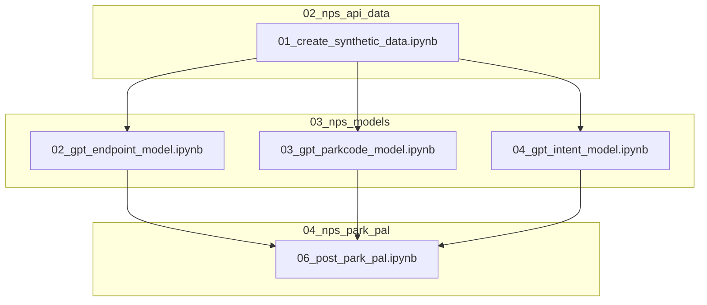

# Park Pal 🐻

### Table of Contents
1. [Introduction](https://github.com/nblakkanesser/MADS_Capstone/tree/main?tab=readme-ov-file#introduction)
2. [Features](https://github.com/nblakkanesser/MADS_Capstone/tree/main?tab=readme-ov-file#features)
3. [Installation](https://github.com/nblakkanesser/MADS_Capstone/tree/main?tab=readme-ov-file#installation)
4. [Data Access](https://github.com/nblakkanesser/MADS_Capstone/tree/main?tab=readme-ov-file#data-access)
4. [Usage](https://github.com/nblakkanesser/MADS_Capstone/tree/main?tab=readme-ov-file#usage)
5. [Configuration](https://github.com/nblakkanesser/MADS_Capstone/tree/main?tab=readme-ov-file#configuration)
6. [Process Highlights](https://github.com/nblakkanesser/MADS_Capstone/tree/main?tab=readme-ov-file#process-highlights)
7. [Contributors](https://github.com/nblakkanesser/MADS_Capstone/tree/main?tab=readme-ov-file#contributors)

### Introduction:

Park Pal is an interactive chatbot backed by the National Park Service (NPS) API. \
Park Pal can answer questions about parks, amenities, events, fees, and more.\
Park Pal is hosted using AWS and can be accessed using the following link: [Insert Linke Here]\
Using this repo, you can also host Park Pal locally.

### Features:
- Comprehensive Park Information: Access detailed information about all national parks, including descriptions, events, and amenities.
- Real-time Data: Get the latest updates on park alerts, events, and fees from the NPS API.
- Accessibility Information: Access details about park accessibility features, including trails, facilities, and services for visitors with disabilities.

### Installation
Steps to install and set up the project:

1. Clone the repository:
```sh
git clone https://github.com/nblakkanesser/MADS_Capstone.git
```
2. Navigate to the project directory:
```sh
cd MADS_Capstone
```
3. Install dependencies:
```sh
pip install -r requirements.txt
```
4. After installing the dependencies, you need to download the spaCy language model. Run the following command:
```sh
python -m spacy download en_core_web_sm
```
### Data Access:

### Data Sources
1. **National Parks Service API**: This project uses data from the National Parks Service API to fine-tune OpenAI GPT models.
2. **National Parks Service: IRMA**: The NPS visitation data analysis was conducted using data from the NPS IRMA Portal.
3. **OpenAI API**: The project also utilizes OpenAI models for which an API key will be needed.

### Accessing the Data
#### NPS IRMA
 1. **Navigate to portal**: [NPS IRMA Portal](https://irma.nps.gov/Stats/SSRSReports/National%20Reports/Query%20Builder%20for%20Public%20Use%20Statistics%20(1979%20-%20Last%20Calendar%20Year))
 2. **Set Query Parameters**
    Select all on the following:
    - Select Region(s)
    - Select Park(s)
    - Select Additional Field(s)
    - Select Field Name(s)
3. **Click View Report**
4. **Download Data to CSV**
5. **Save CSV to 05_nps_analysis  Folder**

#### NPS API & OpenAI
1. **Obtain API Keys**:
   - **NPS API Key**: Sign up at [NPS Developer Portal](https://www.nps.gov/subjects/developer/get-started.htm) to receive your API key.
   - **OpenAI API Key**: Sign up at [OpenAI API Platform](https://platform.openai.com/api-keys) to obtain your API key.

2. **Configuration**:
   - Store your API keys in the `env.py` file by setting the appropriate environment variables to include your API keys. More information can be found in the [Configuration](https://github.com/nblakkanesser/MADS_Capstone/tree/main?tab=readme-ov-file#configuration) section.


**Data Usage**:
   - Ensure you comply with the terms of use for the NPS API and OpenAI API.
   - Follow any data usage and privacy policies associated with the APIs.

### Usage:

#### Local Park Pal Hosting:

#### AWS Park Pal Hosting:
[INSERT PROCESS HERE]

### Configuration

#### Environment Notebook Setup Procedure

The notebooks in this repo use a custom environment function to set user specific values such as secrets, API keys, and folder paths. Users can add a env.py to the environment folder using the following structure to initialize their environment values. This notebook must be completed prior to running the code.

```python
def env():
	dict = {'nps_api_key': '', # The users specific NPS API key. The key can be requested here: https://www.nps.gov/subjects/developer/get-started.htm
		 'gpt_api_key': '', # The users specific OpenAI API key. The key can be requested here: https://platform.openai.com/api-keys
		 'root': '', # The users specific root folder path containing the repo Example: "C:\\Users\\[INSERT USER]\\Documents\\MADS 2021\\Capstone\\MADS_Capstone\\"
		 'gpt_parkcode_model': '', # The OpenAI Job ID for the parkcode model fine tuned using the GPT Model notebooks.
		 'gpt_endpoint_model': '', # The OpenAI Job ID for the endpoint model fine tuned using the GPT Model notebooks.
		 'gpt_intent_model':'',# The OpenAI Job ID for the intent model fine tuned using the GPT Model notebooks.
		 }
	return dict
```

### Process Highlights:

#### 1. 02_nps_api_data/01_create_synthetic_data.ipynb
##### create_synthetic_queries function
```python
"""
    Creates synthetic data in the necessary format for a specified API call.

    api_key: Personal API key to use in request.
    entities: List of items to loop through such as State, Parks, Amentities.
    endpoint: the NPS API endpoint to call such as /activities or /parks.
    intent: A more specific label for queries that use the same endpoint. 
            For example, the questions "Tell me about {park}" and "Where is {park} located" 
            are answered by the same endpoint. Therefore, it is necessary to ascribe an intent 
            to the distinguish the questions. The first example could have the 'description' 
            intent and the second could have the 'address' intent.
    queries: A list of queries you would like to associate with a given set of API calls.
    """

queries = ["Tell me about {entity}","Give me a description of {entity}","Describe {entity} to me","What is the description of {entity}?"]
ParkDesc = create_synthetic_queries(nps_api_key, entities = parks_combined, endpoint = "parks", intent = "description", queries = queries)
```

#### 2. 03_nps_models/02_gpt_endpoint_model.ipynb & 03_gpt_parkcode_model.ipynb & 04_gpt_intent_model.ipynb
##### Upload synthetic data to OpenAI
```python
# Upload a file that can be used across various endpoints. Individual files can be up to 512 MB, and the size of all files uploaded by one organization can be up to 100 GB.
  # Documentation: https://platform.openai.com/docs/api-reference/files/create
train_file =  client.files.create(
  file=open(train_data, "rb"),
  purpose="fine-tune"
)

val_file = client.files.create(
  file=open(val_data, "rb"),
  purpose="fine-tune"
)

# Retrieve file id to be used in fine tuning job
train_file_id = train_file.id
val_file_id = val_file.id
```

##### Run fine-tuning job programmatically
```python
# Creates a fine-tuning job which begins the process of creating a new model from a given dataset.
  # Documentation: https://platform.openai.com/docs/api-reference/fine-tuning/create
fine_tune = client.fine_tuning.jobs.create(
    # The Davinci model was selected for its performance as a completion model over using a chat model based on our use case.
    # We also tried using the gpt-3.5-turbo and we were unable to get the model to complete after an hour of training.
    # Conversely, the davinci model averaged a 20 minute training period.
    model="davinci-002",
    training_file=train_file_id,
    validation_file=val_file_id,
    seed = 42,
    suffix = model_name
)
# The fine tune id needs to be retained and set in the environment file to be used when calling the fine-tuned model.
fine_tune_id = fine_tune.id
```

#### 3. 04_nps_park_pal/06_post_park_pal.ipynb
##### Host Park Pal locally
```python
app = Flask(__name__)

@app.route('/')
def home():
    return render_template('index.html')

@app.route('/chat', methods=['POST'])
def chat():
    user_input = request.json.get("message")
    if not user_input:
        return jsonify({"response": "Please provide a message."})

    try:
        # Calls the OpenAI Fine-tuned GPT models (each run will charge the account)
        output = nps_model_functions.api_call(user_input)
    except:
        output = "I specialize only in queries related to amenities, events, alerts, park fees, park locations, and park descriptions. Please clarify your question."
    return jsonify({"response": output})

if __name__ == "__main__":
    app.run(port=8000)
```

### Contributors

1. Nicole Blakkan-Esser
2. Lauralyn Curry-Leech 
3. Courtney Gibson: gibsonce@umich.edu

Project Link - https://github.com/nblakkanesser/MADS_Capstone.git

