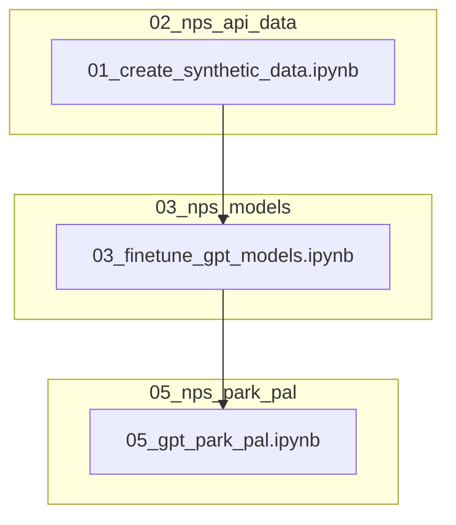

# Park Pal 🐻

### Table of Contents
1. [Introduction](https://github.com/nblakkanesser/MADS_Capstone/tree/main?tab=readme-ov-file#introduction)
2. [Features](https://github.com/nblakkanesser/MADS_Capstone/tree/main?tab=readme-ov-file#features)
3. [Installation](https://github.com/nblakkanesser/MADS_Capstone/tree/main?tab=readme-ov-file#installation)
4. [Data Access](https://github.com/nblakkanesser/MADS_Capstone/tree/main?tab=readme-ov-file#data-access)
5. [Configuration](https://github.com/nblakkanesser/MADS_Capstone/tree/main?tab=readme-ov-file#configuration)
4. [Usage](https://github.com/nblakkanesser/MADS_Capstone/tree/main?tab=readme-ov-file#usage)
6. [Process Highlights](https://github.com/nblakkanesser/MADS_Capstone/tree/main?tab=readme-ov-file#process-highlights)
7. [Contributors](https://github.com/nblakkanesser/MADS_Capstone/tree/main?tab=readme-ov-file#contributors)

### Introduction:

- Park Pal is an interactive chatbot backed by the National Park Service (NPS) API. 
- Park Pal can answer questions about parks, amenities, events, fees, and more.
- Park Pal is hosted locally using Flask and can be accessed in one step by running the 06_lang_park_pal notebook.

### Features:
- Comprehensive Park Information: Access detailed information about all national parks, including descriptions, events, and amenities.
- Real-time Data: Get the latest updates on park alerts, events, and fees from the NPS API.

### Installation
Steps to install and set up the project:

1. Clone the repository:
```sh
git clone https://github.com/nblakkanesser/MADS_Capstone.git
```
2. Navigate to the project directory:
```sh
cd MADS_Capstone
```
3. Install dependencies:
```sh
pip install -r requirements.txt
```
4. After installing the dependencies, you need to download the spaCy language model. Run the following command:
```sh
python -m spacy download en_core_web_sm
```
### Data Access

Resource Ownership
1. **National Parks Service API**: This chatbot uses data from the National Parks Service API to fine-tune OpenAI GPT models.
2. **National Parks Service IRMA**: The NPS visitation data analysis was conducted using data from the NPS IRMA Portal.
3. **OpenAI API**: The project also utilizes OpenAI models for which an API key will be needed.

Accessing the Resources
- NPS IRMA
    - **Navigate to portal** [NPS IRMA Portal](https://irma.nps.gov/Stats/SSRSReports/National%20Reports/Query%20Builder%20for%20Public%20Use%20Statistics%20(1979%20-%20Last%20Calendar%20Year))
    - **Set query parameters**/
        Select all on the following:
        - Select Region(s)
        - Select Park(s)
        - Select Additional Field(s)
        - Select Field Name(s)
    - **Click 'View Report'**
    - **Download data to CSV**
    - **Save CSV to 05_nps_evaluation folder**
    - Additionally, the original data, used to conduct the analysis, can be found in the 05_nps_evaluation folder at nps_visitations_2023.csv

- NPS API & OpenAI
    - **Obtain API Keys**
        - **NPS API Key**: Sign up at [NPS Developer Portal](https://www.nps.gov/subjects/developer/get-started.htm) to receive your API key.
            - The 02_nps_api_data\02_nps_api_example_usage.ipynb file can be used to explore how to interact with the API.
        - **OpenAI API Key**: Sign up at [OpenAI API Platform](https://platform.openai.com/api-keys) to obtain your API key.

    - **Update Environment Variables**
        - Store your API keys in the `env.py` file by setting the appropriate environment variables to include your API keys. More information can be found in the [Configuration](https://github.com/nblakkanesser/MADS_Capstone/tree/main?tab=readme-ov-file#configuration) section.

- Licensing Information
    1. **National Parks Service Data**: 
        - [NPS Licensing Statement](https://www.nps.gov/aboutus/disclaimer.htm)
        - "Copyright law does not protect “any work of the U.S. Government” where “a work prepared by an officer or employee of the U.S. Government as part of that person's official duties” (See, 17 U.S.C. §§ 101, 105). Thus, material created by the NPS and presented on this website, unless otherwise indicated, is generally considered in the public domain. It may be distributed or copied as permitted by applicable law."
        - Limits are placed on the number of API requests you may make using your API key.
            - Hourly Limit: 1,000 requests per hour

### Configuration

#### Environment Notebook Setup Procedure

The notebooks in this repo use a custom environment function to set user specific values such as secrets, API keys, and folder paths. Users can add a env.py to the environment folder using the following structure to initialize their environment values. This notebook must be completed prior to running the code.

```python
def env():
	dict = {'nps_api_key': '', # The users specific NPS API key. The key can be requested here: https://www.nps.gov/subjects/developer/get-started.htm
		 'gpt_api_key': '', # The users specific OpenAI API key. The key can be requested here: https://platform.openai.com/api-keys
		 'gpt_parkcode_model': '', # The OpenAI Job ID for the parkcode model fine tuned using the GPT Model notebooks.
		 'gpt_endpoint_model': '', # The OpenAI Job ID for the endpoint model fine tuned using the GPT Model notebooks.
		 'gpt_intent_model':'',# The OpenAI Job ID for the intent model fine tuned using the GPT Model notebooks.
		 }
	return dict
```

### Repo Usage:

Please review the 01_documentation folder for an inventory of files and notebooks. 

#### GPT Park Pal Hosting:
Run the notebooks using the following process flow to host the GPT enabled Park Pal on your local 8000 port.

#### LangChain Park Pal Hosting:
[INSERT PROCESS HERE]

### Process Highlights:

#### 1. 02_nps_api_data/01_create_synthetic_data.ipynb
##### create_synthetic_queries function
```python
"""
    Creates synthetic data in the necessary format for a specified API call.

    api_key: Personal API key to use in request.
    entities: List of items to loop through such as State, Parks, Amentities.
    endpoint: the NPS API endpoint to call such as /activities or /parks.
    intent: A more specific label for queries that use the same endpoint. 
            For example, the questions "Tell me about {park}" and "Where is {park} located" 
            are answered by the same endpoint. Therefore, it is necessary to ascribe an intent 
            to the distinguish the questions. The first example could have the 'description' 
            intent and the second could have the 'address' intent.
    queries: A list of queries you would like to associate with a given set of API calls.
    """

queries = ["Tell me about {entity}","Give me a description of {entity}","Describe {entity} to me","What is the description of {entity}?"]
ParkDesc = create_synthetic_queries(nps_api_key, entities = parks_combined, endpoint = "parks", intent = "description", queries = queries)
```

#### 2. gpt_model_functions.py
##### Upload synthetic data to OpenAI
```python
# Upload a file that can be used across various endpoints. Individual files can be up to 512 MB, and the size of all files uploaded by one organization can be up to 100 GB.
    # Documentation: https://platform.openai.com/docs/api-reference/files/create
  train_file =  client.files.create(
    file=open(f'{target}_train_data.jsonl', "rb"),
    purpose="fine-tune"
  )

  val_file = client.files.create(
    file=open(f'{target}_val_data.jsonl', "rb"),
    purpose="fine-tune"
  )

# Retrieve file id to be used in fine tuning job
train_file_id = train_file.id
val_file_id = val_file.id
```

##### Run fine-tuning job programmatically
```python
# Creates a fine-tuning job which begins the process of creating a new model from a given dataset.
    # Documentation: https://platform.openai.com/docs/api-reference/fine-tuning/create
fine_tune = client.fine_tuning.jobs.create(
    # The Davinci model was selected for its performance as a completion model over using a chat model based on our use case.
    # We also tried using the gpt-3.5-turbo and we were unable to get the model to complete after an hour of training.
    # Conversely, the davinci model averaged a 20 minute training period.
    model="davinci-002",
    training_file=train_file_id,
    validation_file=val_file_id,
    seed = 42,
    suffix = f'nps_model_{target}'
    )
# The fine tune id needs to be retained and set in the environment file to be used when calling the fine-tuned model.
fine_tune_id = fine_tune.id
```

#### 3. 04_nps_park_pal/06_post_park_pal.ipynb
##### Host Park Pal locally
```python
app = Flask(__name__)

# Configure server-side session
app.config['SESSION_TYPE'] = 'filesystem'
app.config['SECRET_KEY'] = 'supersecretkey'
Session(app)

@app.route('/reset', methods=['POST'])
def reset():
    session.clear()
    return jsonify({"response": "Session reset successful."})

@app.route('/')
def home():
    return render_template('index.html')

@app.route('/chat', methods=['POST'])
def chat():
    # *Chat GPT assisted with session logic
    user_input = request.json.get("message")
    if not user_input:
        return jsonify({"response": "Please provide a message."})

    if 'stage' not in session:
        session['stage'] = 'initial'

    if session['stage'] == 'initial':
        # Initial stage: Handle general queries
        output, session['stage'], session['data'] = handle_initial_query(user_input)
        
    elif session['stage'] == 'amenities':
        # Handle amenity category selection
        output, session['stage'] = handle_amenity_selection(user_input, session['data'])
    else:
        output = "I specialize only in queries related to amenities, events, alerts, park fees, park locations, and park descriptions. Please clarify your question."
        session['stage'] = 'initial'

    return jsonify({"response": output})

def handle_initial_query(user_input):
    # Simulate API call to get responses for the 'amenities' endpoint
    try: 
        output = api_call(user_input)
        if isinstance(output, pd.DataFrame):
            # The nps_model_function returns a dataframe for questions that are predicted to be amenities.
            responses_df = output
            # List the amenity categories for the user to review
            categories = sorted(list(set(element.lower() for sublist in responses_df['categories'] for element in sublist)))
            if len(categories) > 0:
                # Count of categories and list them
                response = f'There are {len(categories)} amenity categories. Choose one of the following categories to learn more: '
                for category in categories:
                    response += f'\n {category}'

                return response, 'amenities', responses_df
            else:
                # If there are no categories then return this:
                return f'There are no amenities available to share at this time', 'initial', None
        return output, 'initial', None
    # If the bot does not understand the question, ask to clarify.
    except:
        return "I specialize only in queries related to amenities, events, alerts, park fees, park locations, and park descriptions. Please clarify your question.", 'initial', None

def handle_amenity_selection(user_input, responses_df):
    # Create list of amenities in the specified category
    amenities_df = responses_df[responses_df['categories'].apply(lambda x: user_input.lower() in [item.lower() for item in x])]
    amenities = sorted(list(set(name for name in amenities_df['name'])))
    
    if len(amenities) > 0:
        # Count of amenities and list them
        output = f'There {"is" if len(amenities) == 1 else "are"} {len(amenities)} {"amenity" if len(amenities) == 1 else "amenities"} in the {user_input.title()} category: '
        for amenity in amenities:
            output += f'\n {amenity}'
        return output, 'initial'
    else:
        # If there are no amenity then return this:
        return "The specified category is not an option. Please try again.", 'initial'

if __name__ == "__main__":
    app.run(port=8000)
```

### Contributors

1. Nicole Blakkan-Esser: nblakkan@umich.edu
2. Lauralyn Curry-Leech: llcl@umich.edu
3. Courtney Gibson: gibsonce@umich.edu

Project Link - https://github.com/nblakkanesser/MADS_Capstone.git

